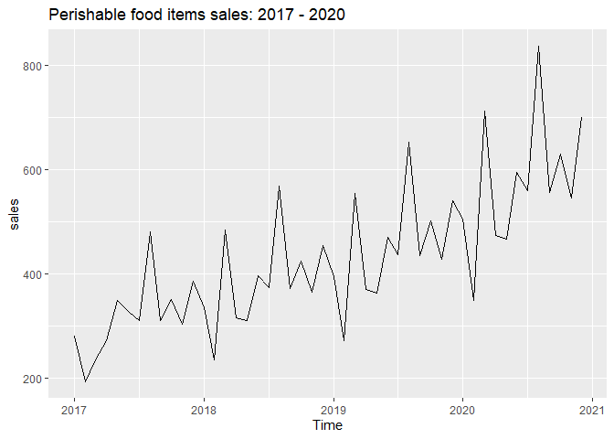
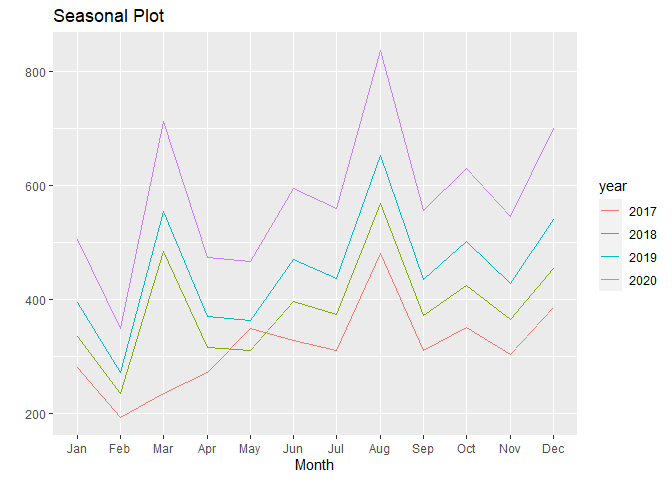
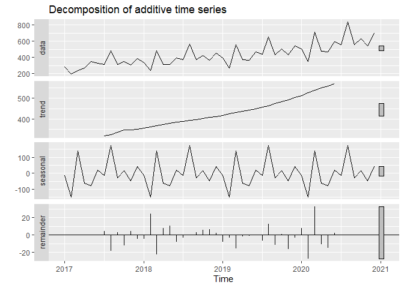
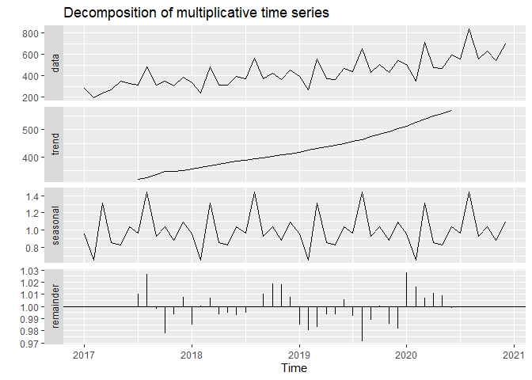
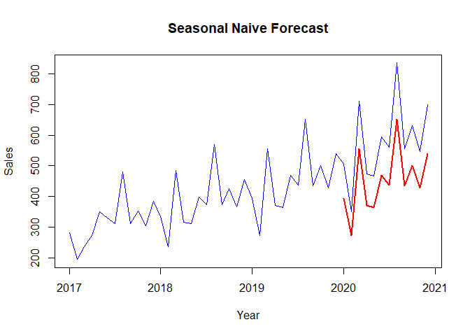
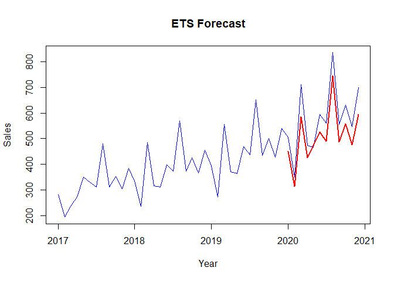
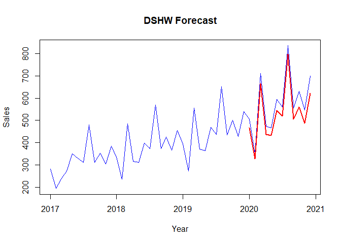
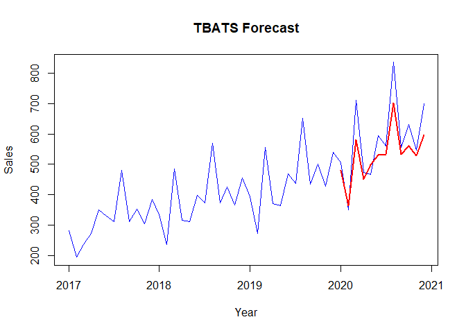
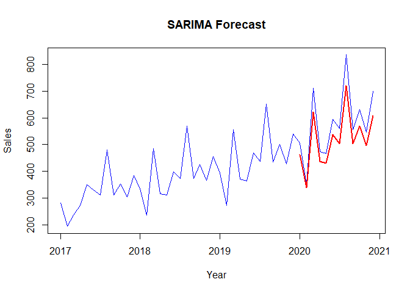

Time Series Predictive Model
================
Ragdoll99
2022-10-27

## Time Series Predictive Model for demand of perishable food item.

This is a project to showcase time series predictive modelling.

Background: A local supermarket often face the issue of over or under
production of one of its perishable house brand food item. There are
times when the supermarket over produce the item and need to discard
large quantity of the expired goods. On the other hand, when demand
exceed supply, the supermarket is not maximising its profit.

The supermarket has engaged data scientist to create a forecasting model
to avoid over or under production. The task is to create an appropriate
time series predicitve model.

#### Loading library

``` r
library(knitr)
library(tidyverse)
library(dplyr)
library(ggplot2)
library(seasonal) 
library(fpp2)
library(forecast)
library(MLmetrics)
```

#### Loading Dataset

``` r
df <- read.csv("../data/Q2_Perishable.csv")
head(df)
```

    ##   Index Year Month Sales..in.thousands.
    ## 1     1 2017   Jan                280.9
    ## 2     2 2017   Feb                194.1
    ## 3     3 2017   Mar                236.0
    ## 4     4 2017   Apr                271.8
    ## 5     5 2017   May                349.4
    ## 6     6 2017   Jun                328.8

#### Convert to times series

Derive date in the dataset

``` r
df$date <- paste("01",df$Month,as.character(df$Year),sep="-")
df$date <- as.Date(df$date, "%d-%b-%Y")
df$date
```

    ##  [1] "2017-01-01" "2017-02-01" "2017-03-01" "2017-04-01" "2017-05-01"
    ##  [6] "2017-06-01" "2017-07-01" "2017-08-01" "2017-09-01" "2017-10-01"
    ## [11] "2017-11-01" "2017-12-01" "2018-01-01" "2018-02-01" "2018-03-01"
    ## [16] "2018-04-01" "2018-05-01" "2018-06-01" "2018-07-01" "2018-08-01"
    ## [21] "2018-09-01" "2018-10-01" "2018-11-01" "2018-12-01" "2019-01-01"
    ## [26] "2019-02-01" "2019-03-01" "2019-04-01" "2019-05-01" "2019-06-01"
    ## [31] "2019-07-01" "2019-08-01" "2019-09-01" "2019-10-01" "2019-11-01"
    ## [36] "2019-12-01" "2020-01-01" "2020-02-01" "2020-03-01" "2020-04-01"
    ## [41] "2020-05-01" "2020-06-01" "2020-07-01" "2020-08-01" "2020-09-01"
    ## [46] "2020-10-01" "2020-11-01" "2020-12-01"

  
as noticed, this is monthly data which started on 2017 Jan with 12
months in frequency. We can convert it to time series with ts function.

``` r
sales <- ts(df$Sales..in.thousands., frequency = 12, start = 2017)
sales
```

    ##        Jan   Feb   Mar   Apr   May   Jun   Jul   Aug   Sep   Oct   Nov   Dec
    ## 2017 280.9 194.1 236.0 271.8 349.4 328.8 311.3 480.0 310.5 351.8 304.5 385.3
    ## 2018 334.5 236.0 485.0 315.8 311.0 397.1 373.4 568.3 372.6 424.6 365.4 455.0
    ## 2019 394.4 271.8 555.0 369.6 362.9 470.0 436.9 652.3 434.8 502.0 428.8 540.5
    ## 2020 505.5 349.4 712.0 473.6 466.6 594.4 560.1 835.5 556.5 630.3 545.5 700.0

#### Data Exploration

Basic Plot

``` r
autoplot(sales, main = "Perishable food items sales: 2017 - 2020")
```

<!-- -->  

``` r
ggseasonplot(sales, main = "Seasonal Plot")
```

<!-- -->  
Decomposition of times series.

``` r
decomposed_sales_additive <- decompose(sales, type = "additive")
autoplot(decomposed_sales_additive)
```

<!-- -->  
In the decomposition chart there is 4 compononents:  
1. Original data  
2. Trend: calculated by moving average of data.  
3. Seasonal: original data subtract the trend then average the results
by month.  
4. Remainder: take the data subtract the trend and the seasonal
component. 

``` r
decomposed_sales_multiplicative <- decompose(sales, type = "multiplicative")
autoplot(decomposed_sales_multiplicative)
```

<!-- -->

  
Next, we split data to training and test set for building model and
evaluate the errors.

``` r
#Create samples
training=window(sales, start = c(2017,1), end = c(2019,12))
test=window(sales, start = c(2020,1))
```

### Forecasting

#### Naive Method

This is the baseline model. Any forecasting method should be evaluated
by being compared to this Naive method. It is based on the assumption
that forecast for tomorrow is what we are observing today.

``` r
naive = snaive(training, h=length(test))
Naive_MAPE <- MAPE(naive$mean, test) * 100
Naive_MAPE
```

    ## [1] 21.80644

``` r
plot(sales, col="blue", xlab="Year", ylab="Sales", main="Seasonal Naive Forecast", type='l') +
  lines(naive$mean, col="red", lwd=2)
```

<!-- -->


#### Exponential Smoothing

The idea of exponential smoothing is to have a declining weight given to
observations. The more recent an observation, the more importance it
will have in our forecast

State Space Models:

``` r
ets_model = ets(training, allow.multiplicative.trend = TRUE)
summary(ets_model)
```

    ## ETS(M,A,M) 
    ## 
    ## Call:
    ##  ets(y = training, allow.multiplicative.trend = TRUE) 
    ## 
    ##   Smoothing parameters:
    ##     alpha = 0.0067 
    ##     beta  = 0.0067 
    ##     gamma = 1e-04 
    ## 
    ##   Initial states:
    ##     l = 288.8064 
    ##     b = 5.5818 
    ##     s = 1.104 0.8938 1.0579 0.9331 1.4418 0.9575
    ##            1.0363 0.9419 0.857 1.1921 0.6477 0.9369
    ## 
    ##   sigma:  0.1029
    ## 
    ##      AIC     AICc      BIC 
    ## 404.8663 438.8663 431.7861 
    ## 
    ## Training set error measures:
    ##                     ME     RMSE      MAE       MPE     MAPE      MASE
    ## Training set -1.289852 28.38238 13.61047 -1.228578 4.078223 0.1931248
    ##                     ACF1
    ## Training set -0.02855346

 

``` r
ets_forecast = forecast(ets_model, h=length(test))
ETS_MAPE <- MAPE(ets_forecast$mean, test) *100
ETS_MAPE
```

    ## [1] 11.36357

  
The ETS is additive with a MAPE of 11.36 to our testing data

``` r
plot(sales, col="blue", xlab="Year", ylab="Sales", main="ETS Forecast", type='l') +
  lines(ets_forecast$mean, col="red", lwd=2)
```

<!-- -->

  
Double Seasonal Holt-Winters:

ETS function is only allow for one seasonality. 
Sometimes, there could be multiple seasonality (e.g Monthly
and yearly). For double seasonal holt-winters method, it allow for two
seasonality, a smaller one repeated often and bigger one repeated less
often. we will use quarterly (every 3 months) and Yearly (every 12
months) for DSHW two period of seasonal effects.

``` r
dshw_model = dshw(training, period1=3, period2 = 12, h=length(test))
DSHW_MAPE <- MAPE(dshw_model$mean, test)*100
DSHW_MAPE
```

    ## [1] 8.166625

``` r
plot(sales, col="blue", xlab="Year", ylab="Sales", main="DSHW Forecast", type='l') +
  lines(dshw_model$mean, col="red", lwd=2)
```

<!-- -->


#### BATS and TBATS

DSHW allow for two seasonality. However, in some complex timeseries,
there could be more thatn 2. BATS and TBATS allow for multiple
seasonalities. TBATS is a improvement of BATS that allows for multiple
non-integer seasonality cycles.

``` r
tbats_model = tbats(training)
tbats_forecast = forecast(tbats_model, h=length(test))
TBATS_MAPE <- MAPE(tbats_forecast$mean, test) * 100
TBATS_MAPE
```

    ## [1] 8.660965

``` r
plot(sales, col="blue", xlab="Year", ylab="Sales", main="TBATS Forecast", type='l') +
  lines(tbats_forecast$mean, col="red", lwd=2)
```

<!-- -->


#### ARIMA Model

ARIMA models contain: 
1. AR(p) : autoregressive part of the model. 
2. Differencing(d) : lags 
3. MA(q): forecast errors

We use auto.arima function to return the best estimated model.

``` r
arima_optimal = auto.arima(training)
arima_optimal
```

    ## Series: training 
    ## ARIMA(0,0,0)(0,1,0)[12] with drift 
    ## 
    ## Coefficients:
    ##        drift
    ##       5.6063
    ## s.e.  0.7640
    ## 
    ## sigma^2 = 2105:  log likelihood = -125.37
    ## AIC=254.73   AICc=255.31   BIC=257.09

  
To forecast using ARIMA model (SARIMA for seasonality), there is a
sarima.for function.

``` r
library(astsa)
```

    ## 
    ## Attaching package: 'astsa'

    ## The following object is masked _by_ '.GlobalEnv':
    ## 
    ##     sales

    ## The following objects are masked from 'package:fma':
    ## 
    ##     chicken, sales

    ## The following object is masked from 'package:forecast':
    ## 
    ##     gas

    ## The following object is masked from 'package:fpp2':
    ## 
    ##     oil

    ## The following objects are masked from 'package:seasonal':
    ## 
    ##     trend, unemp

``` r
sarima_forecast = sarima.for(training, n.ahead=12,
                             p=0,d=0,q=0,P=0,D=1,Q=0,S=12, plot=FALSE)
SARIMA_MAPE <- MAPE(sarima_forecast$pred, test) * 100
SARIMA_MAPE
```

    ## [1] 9.579582

``` r
plot(sales, col="blue", xlab="Year", ylab="Sales", main="SARIMA Forecast", type='l') +
  lines(sarima_forecast$pred, col="red", lwd=2)
```

<!-- -->


### Model selection

We can combine all the MAPE for model selection:

``` r
Model <- c("Naive", "ETS","DSHW", "TBATS","SARIMA")
MAPE <- c(Naive_MAPE, ETS_MAPE, DSHW_MAPE, TBATS_MAPE, SARIMA_MAPE)

c.df <- data.frame(Model, MAPE)
c.df
```

    ##    Model      MAPE
    ## 1  Naive 21.806436
    ## 2    ETS 11.363573
    ## 3   DSHW  8.166625
    ## 4  TBATS  8.660965
    ## 5 SARIMA  9.579582

  
In this study, Double Seasonal Holt-Winters with two season (quarterly
-every 3 months and Yearly-every 12 months) give the lowest MAPE.

Review the forecast again:\
\
<!-- -->
